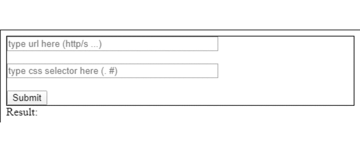

# React scraper

## Tech used:
 - ReactJS
 - Cheerio lib

## Work highlight: 
This is a simple web scraping project done using reactjs  and proxy server.
* Enter url of site you  wish the content to load
* Enter selector u wish to display 
* Click Send and display the result in HTML.

